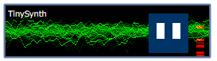

# webaudio-tinysynth
WebAudio Tiny GM Synthesizer [Polymer]

## Overview

**webaudio-tinysynth** is a small synthesizer written in JavaScript with GM like timbre map.

- webaudio-tinysynth is a Polymer dom-module. It can be used with just a Tag, 'webaudio-tinysynth'.
- Receive MIDI message data and generate sounds
- All sounds are generated algolithmically, without any external samples.
- Two timbre set is available. 1 oscillator per 1 note ('quality=0', light-weight, chiptune like sounds), or 2 oscillators for 1 note ('quality=1', FM based sounds).
- built-in MIDI-SMF (.mid file) sequencer. It is initiated by MIDI file drag & drop.

## Live Demo
  
Test Page is here : [https://g200kg.github.io/webaudio-tinysynth/soundedit.html](https://g200kg.github.io/webaudio-tinysynth/soundedit.html)

## Usage

Install Polymer and webaudio-tinysynth

*  **webaudio-tinysynth** is a polymer module. You should prepare polymer related library first. If you know bower, use the command > `bower install --save g200kg/webaudio-tinysynth`. Otherwise, download zipped file and deploy appropriately.


*  load webcomponents.js and polymer in your HTML :
  - `<script src="bower_components/webcomponentsjs/webcomponents-lite.min.js"></script>`
  - `<link rel="import" href="bower_components/polymer/polymer.html">`  


* load webaudio-tinysynth in your HTML
  - `<link rel="import" href="bower_components/webaudio-tinysynth/webaudio-tinysynth.html">`
  - if you use bower, webaudio-tinysynth.html is placed to bower_components/webaudio-tinysynth/ folder, otherwise specify path to webaudio-tinysynth.html  


*  place webaudio-pianoroll element
  - `<webaudio-tinysynth></webaudio-tinysynth>`
  - Note that the polymer module may not be ready immediately after window.onload especially the webcomponents is polyfilled (Firefox / Edge).
  It may cause failure of calling setAudioContext() in window.onload() function.

```
  // in my test code, setAudioContext() is invoked after check :
  synth=document.getElementById("tinysynth");
  timerid=setInterval(function(){
    console.log("Initialize checking.");
    if(synth.setAudioContext){
      synth.setAudioContext(actx);
      clearInterval(timerid);
      console.log("Initialized");
    }
  },200);
```


## Attributes

|Attribute      |Options|Default   |Description            |
|---------------|-------|----------|-----------------------|
|**width**      |String |"256px"   | width of element      |
|**height**     |String |"64px"    | height of element     |
|**masterVol**  |Number | 1.0      | master volume         |
|**reverbLev**  |Number | 0.3      | reverb level          |
|**quality**    |Number | 1        | 0: 1osc/note chiptune like<br/> 1: 2osc/note FM based|
|**src**        |String |null      | .mid file url         |
|**loop**       |Number | 0        | loop playMIDI         |

* attributes values can be modified from javascript if needed.

## Functions
**setAudioContext(audioContext, destinationNode)**  
> Before sound generation, audioContext should be set.
If the destinationNode is specified, all sounds are send to destinationNode. Note that the webaudio-tinysynth may not be ready yet immediately after 'window.onload'. especially be careful for Firefox/Edge because of webcomponents may be polyfilled.

**send([midi message],t)**
> midi message is a array of midi data bytes. For example,  
> `send([0x90, 60, 100],t)` for NoteOn note=60 velocity=100.
> `t` is a timestamp that this message should be processed, in timeline of audioContext.

**loadMIDI(mididata)**
> load MIDI data to built-in sequencer. mididata is a arraybuffer of SMF (.mid file contents).

**loadMIDIUrl(url)**
> load MIDI data from specified url

**playMIDI()**
> play loaded MIDI data.

**stopMIDI()**
> stop playing MIDI data.

**getTimbreName(m,n)**
> get name of specified timbre. m=0:normal channel voice,n=prog#. or m=1:drum track,n=note#

## MIDI implimentation chart

|                       |Recognized|Description                     |
|-----------------------|----------|--------------------------------|
|**Basic Channel**      | Yes      | 1-16. ch10 = drum track        |
|**NoteOn / NoteOff**   | Yes      | note# 0-127 / velocity 0-127   |
|**Polyphonic Pressure**| No       |                                |
|**Control Change**     | Yes      | see bellow                     |
|**Program Change**     | Yes      | program 0-127                  |
|**Channel Pressure**   | No       |                                |
|**Pitch Bend**         | Yes      | -8192 - +8191                               |
||||
|**Control Number**|||
|**6 / 38**|Yes|Data Entry|
|**7**|Yes|Channel Volume|
|**11**|Yes|Expression|
|**64**|Yes|Sustain|
|**100/101**|Yes|RPN Index|
||||
|**Channel Mode Message**|||
|**120**| Yes | all sound off|
|**121**| Yes | reset all controller|
|**123**| Yes | all note off|
||||
|**RPN**|||
|**0**|Bend Range||
|||||

## License

webaudio-pianoroll is licensed under the Apache License, Version 2.0
